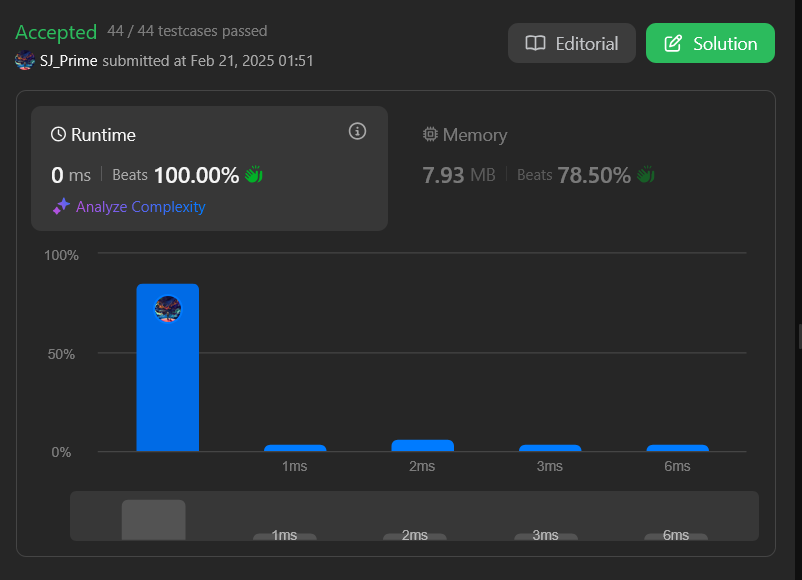

290. Word Pattern

Given a pattern and a string s, find if s follows the same pattern.

Here follow means a full match, such that there is a bijection between a letter in pattern and a non-empty word in s. Specifically:

    Each letter in pattern maps to exactly one unique word in s.
    Each unique word in s maps to exactly one letter in pattern.
    No two letters map to the same word, and no two words map to the same letter.

 

Example 1:

Input: pattern = "abba", s = "dog cat cat dog"

Output: true

Explanation:

The bijection can be established as:

    'a' maps to "dog".
    'b' maps to "cat".

Example 2:

Input: pattern = "abba", s = "dog cat cat fish"

Output: false

Example 3:

Input: pattern = "aaaa", s = "dog cat cat dog"

Output: false

 

Constraints:

    1 <= pattern.length <= 300
    pattern contains only lower-case English letters.
    1 <= s.length <= 3000
    s contains only lowercase English letters and spaces ' '.
    s does not contain any leading or trailing spaces.
    All the words in s are separated by a single space.

