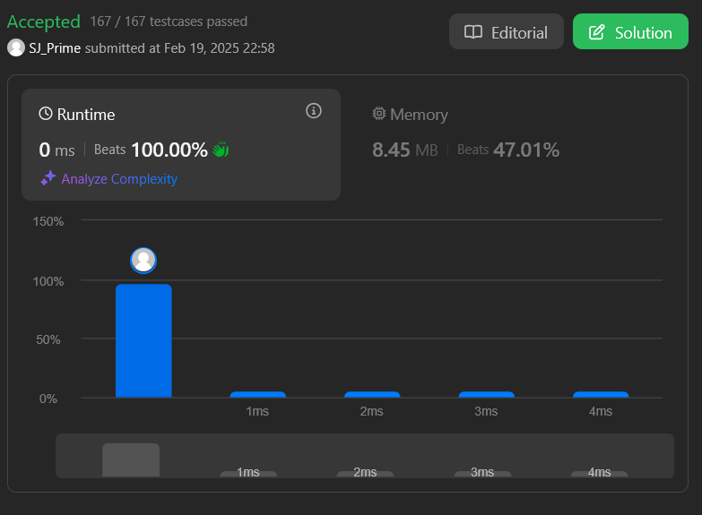

744. Find Smallest Letter Greater Than Target

You are given an array of characters letters that is sorted in non-decreasing order, and a character target. There are at least two different characters in letters.

Return the smallest character in letters that is lexicographically greater than target. If such a character does not exist, return the first character in letters.

 

Example 1:

Input: letters = ["c","f","j"], target = "a"
Output: "c"
Explanation: The smallest character that is lexicographically greater than 'a' in letters is 'c'.

Example 2:

Input: letters = ["c","f","j"], target = "c"
Output: "f"
Explanation: The smallest character that is lexicographically greater than 'c' in letters is 'f'.

Example 3:

Input: letters = ["x","x","y","y"], target = "z"
Output: "x"
Explanation: There are no characters in letters that is lexicographically greater than 'z' so we return letters[0].

 

Constraints:

    2 <= letters.length <= 104
    letters[i] is a lowercase English letter.
    letters is sorted in non-decreasing order.
    letters contains at least two different characters.
    target is a lowercase English letter.

